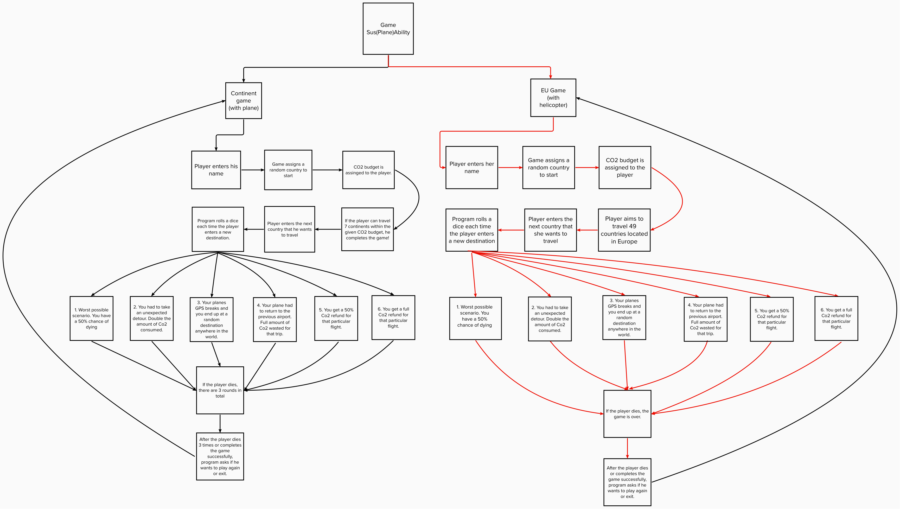

# Flight_game-group2
# Table of contents
* Introduction
* Vision
* Functional Requirements
* Quality Requirements
# Introduction
This documentation specifies the preliminary stages of design, functionality, gameplay of the game with the provisional title “SUS(PLANE)ABILITY”. This is a computer-based game, developed by the “Group-2”. It is based on elements discussed in various meetings held since 26th of September 2022.

The study is dedicated to game prototype development. A prototype is an incomplete version of an idea. A prototype contains only a part of the designed functionality. A prototype may be completely different from the final product. Using a prototype, a designer can get early feedback from potential users. It allows estimating the validity of the initial idea.

SUS(PLANE)ABILITY is the prototype of the final flight simulator game. This prototype is the non-graphical version of game. Players will play this game by giving input using keyboard. 

Games are the place to try new ideas and to experiment with established theories. In the Flight game project programmed by python and used PyCharm IDE to execute the programme.
# Scop
This document is intended to read by programmers, supervisors, teachers and other stakeholders. This document contains brief description of the of technical and non-technical aspects of the of Flight game project. This can be used as the road map for the final project.
# Game Concept
SUS(PLANE)ABILITY is a flight simulation game. 

Players will play this game to reach the goal and the goal is to fly as many continents they can travel with the budgeted co2. There is 7 continents available in the game.

OR

Players will play this game to reach the goal and the goal is to fly as many countries they can travel with the budgeted co2. There is 50 countries available in the game.

# Vision
Vision
The purpose of the game is to make an interactive gaming experience for the player and game as per the requirement of project work of software 1.
Player will have two game option to choose from the main menu. It is possible to play the game by using keyboard only. 

Continent game:

Player will start and put his/her name, Player will be assigned a random country and random airport and a budget of Co2. Then player will enter the name of the destination country. Here is some surprise for the player by rolling the dice and give the advantages or disadvantages according to the pre-decided game functions. Player will continue with the game until the budget is get to the end or he/she travelled countries from all 7 continents. Player will have three round to play the game and at the end know the score.

EU Game:

Player will start and put his/her name, Player will be assigned a random country and random heliport and a budget of Co2. Then player will enter the name of the destination country. Here is some surprise for the player by rolling the dice and give the advantages or disadvantages according to the pre-decided game functions. Player will continue with the game until the budget is get to the end or he/she travelled countries from all 50 countries. Player will have three round to play the game and at the end know the score.
# Game Procedure

# Functional requirements (CONTINENT GAME)
•	Player can choose the game want to play from the menu

•	Player can input the name

•	Player can choose the destination country

•	After the three round players will have the option to play new game or to go to the main menu

# Quality requirements (CONTINENT GAME)
•	Screen will show the name of the player

•	Player will get a random country and airport at the beginning

•	Continents will be fetched and showed on the screen based upon the country

•	Fetching the data from the database should not take more than two seconds

•	After each round score will be added to the “score” variable but will not show to the player

• After third round final score will be displayed

# Functional requirements (EU GAME)
•	Player can choose the game want to play from the menu

•	Player can input the name

•	Player can choose the destination country

•   There is only one round and the player has the option to play new game or to go to the main menu

# Quality requirements (EU GAME)
•	Screen will show the name of the player

•	Player will get a random country and heliport at the beginning

•	Countries will be fetched and showed on the screen 

•	Fetching the data from the database should not take more than two seconds

•	After each round score will be added to the “score” variable but will not show to the player

• After one round final score will be displayed
